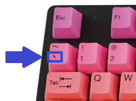
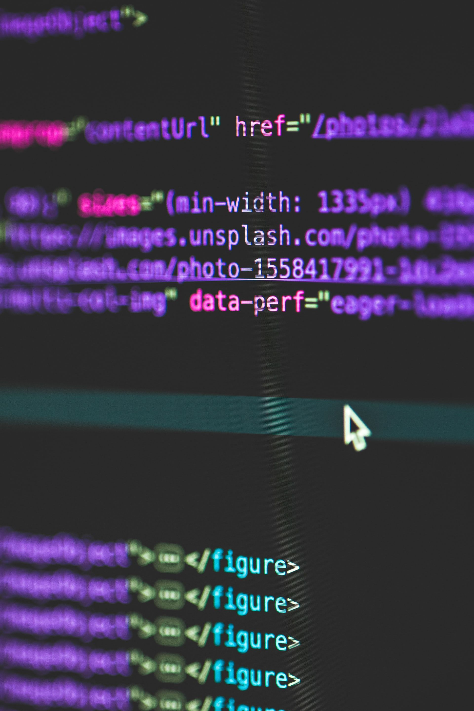
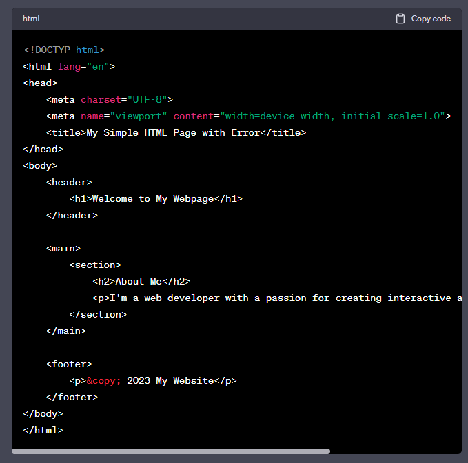
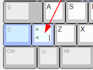

# Writing Good Documentation

## Step 1 - Using Codeblocks.

Codeblocks in markdown make it *very easy* for tech people to **copy, paste, share** code.
A good Cloud Engineer uses Cpdeblocks wheneber possible.

Because it allows other to copy and past their code tp replicate or research issues


- In order to create codeblocks in markdown you need to use three backticks ( ` )
- not to be confused with quotation ( ' )
```
<!DOCTYPE html>
<html lang="en">
<head>
    <meta charset="UTF-8">
    <meta name="viewport" content="width=device-width, initial-scale=1.0">
    <title>My Simple HTML Page</title>
</head>
<body>
    <header>
        <h1>Welcome to My Webpage</h1>
    </header>
    
    <main>
        <section>
            <h2>About Me</h2>
            <p>I'm a web developer with a passion for creating interactive and user-friendly websites.</p>
        </section>
    </main>
    
    <footer>
        <p>&copy; 2023 My Website</p>
    </footer>
</body>
</html>

```
- When you can you should attempt to apply syntax highlighting to your codeblocks
``` HTML
<!DOCTYPE html>
<html lang="en">
<head>
    <meta charset="UTF-8">
    <meta name="viewport" content="width=device-width, initial-scale=1.0">
    <title>My Simple HTML Page</title>
</head>
<body>
    <header>
        <h1>Welcome to My Webpage</h1>
    </header>
    
    <main>
        <section>
            <h2>About Me</h2>
            <p>I'm a web developer with a passion for creating interactive and user-friendly websites.</p>
        </section>
    </main>
    
    <footer>
        <p>&copy; 2023 My Website</p>
    </footer>
</body>
</html>

```
Just a note the location of the **Backtick** may vary depending on the type of your keyboard layout, mostly it will be above the *tab key*.



Good Cloud Engineers use codeblocks for both code and errors that appear in the console.

``` bash
./error.sh: line 4: non_existent_command: command not found
```
> Here is an example of using a codeblock for an error that appears on bash.

## Step 2 - How to take Screenshots.

A screenshot is when you capture a part of your screen from your laptop, desktop or phone.

This is not to be confused with take a photo with your phone

**DO NOT DO THIS**

 

This is what a screenshot from your computer ahould look like.

The hotkey for taking screenshots can vary depending on your operating system. Here are common hotkeys for taking screenshots on popular operating systems:

**Windows:**

1. **Full Screen:** Press the `PrtScn` (Print Screen) key. The screenshot is copied to your clipboard, and you can paste it into an image editor or document.

2. **Active Window:** To capture only the active window, press `Alt + PrtScn`. The screenshot is copied to your clipboard.

3. **Snipping Tool (Windows 7 and 8):** You can use the Snipping Tool by pressing `Windows Key + Shift + S` on Windows 10.

4. **Snip & Sketch (Windows 10):** Press `Windows Key + Shift + S` to open Snip & Sketch for more advanced screenshot options.

5. **Snip & Sketch Shortcut (Windows 10):** Press `Windows Key + Shift + S` to take a screenshot directly using Snip & Sketch.

**macOS:**

1. **Full Screen:** Press `Shift + Command + 3` to capture the entire screen. The screenshot is saved to your desktop.

2. **Partial Screen:** Press `Shift + Command + 4`, and then drag to select the area you want to capture. The screenshot is saved to your desktop.

3. **Active Window:** Press `Shift + Command + 4`, then press the `Spacebar`. Click on the window you want to capture. The screenshot is saved to your desktop.

**Linux (varies by desktop environment):**

- Many Linux distributions use a screenshot utility, often activated by pressing `PrtScn`. The behavior can vary depending on the desktop environment (e.g., GNOME, KDE, XFCE), so check your specific Linux distribution's documentation for details.

These are the most common hotkeys, but there can be variations depending on your specific setup or any third-party screenshot tools you might have installed.



## Step 3 - Using github flavoured Task List

Github ectends Markdown to have a list where you can check off items.[<sup>[1]</sup>](#external-references)

- [x] Finish Step 1
- [x] Finish Step 2
- [x] Finish Step 3
- [x] Finish Step 4
- [x] Finish Step 5

# Step 4 - Using Emojis (Optional Task)

GitHub Flavored Markdown (GFM) supports emojis shortcodes.
> Here are some examples

| Name | Shortcode | Emoji |
| --- | --- | --- |
| Cloud | `:cloud:` | ☁️ |
| Cloud with Lighting | `:cloud_wwith_lighting:` | 🌩️ |

# Step 5 - How to ceate a Table

You can use the below format to create Tables:

```md
| Name | Shortcode | Emoji |
| --- | --- | --- |
| Cloud | `:cloud:` | ☁️ |
| Cloud with Lighting | `:cloud_wwith_lighting:` | 🌩️ |
```
Github extends the functionality of markdown tables to provide more alignment and table cell format options. [<sup>[2]</sup>](#external-references)

Just a note, The location of the **Pipe Key** may vary depending on the type of your keyboard layout, mostly it will be above the *Enter or Retun Key*.



[Secret Window Hidden Garden](secret-window/hidden-garden.md)

## External References
- [GitHub Flavored Markdown Spec](https://github.github.com/gfm/)
  
- [Basic writing and formatting syntax (Github Flavoured Markdown)](https://docs.github.com/en/get-started/writing-on-github/getting-started-with-writing-and-formatting-on-github/basic-writing-and-formatting-syntax)

- [Complete list of github markdown emoji markup](https://gist.github.com/rxaviers/7360908)
  
- [GFM - Task Lists](https://docs.github.com/en/get-started/writing-on-github/getting-started-with-writing-and-formatting-on-github/basic-writing-and-formatting-syntax#task-lists)<sup>[1]</sup>
  
- [GFM - Tables (extension)](https://github.github.com/gfm/#tables-extension-)<sup>[2]</sup>
